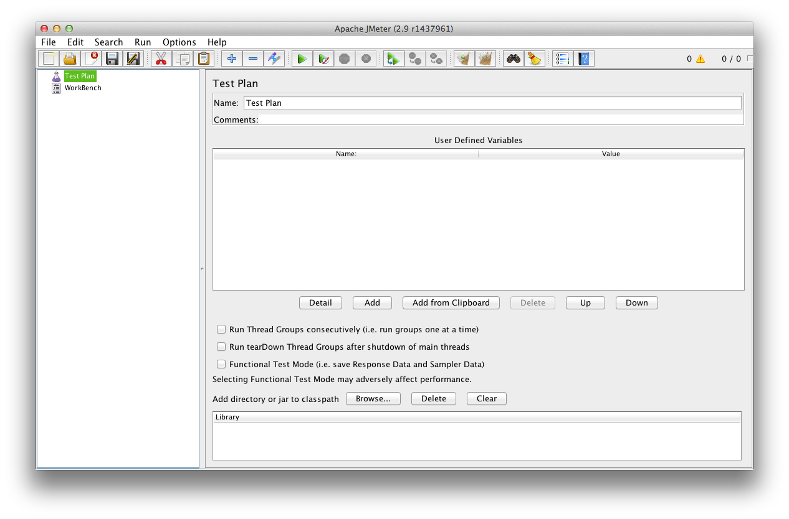
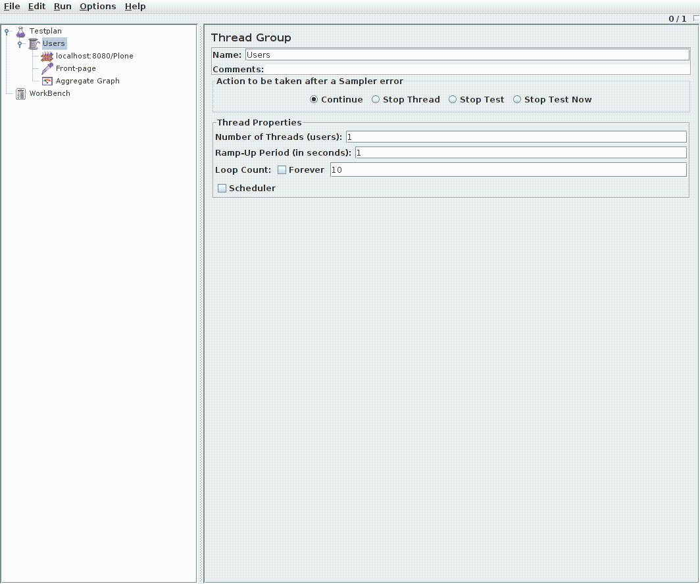
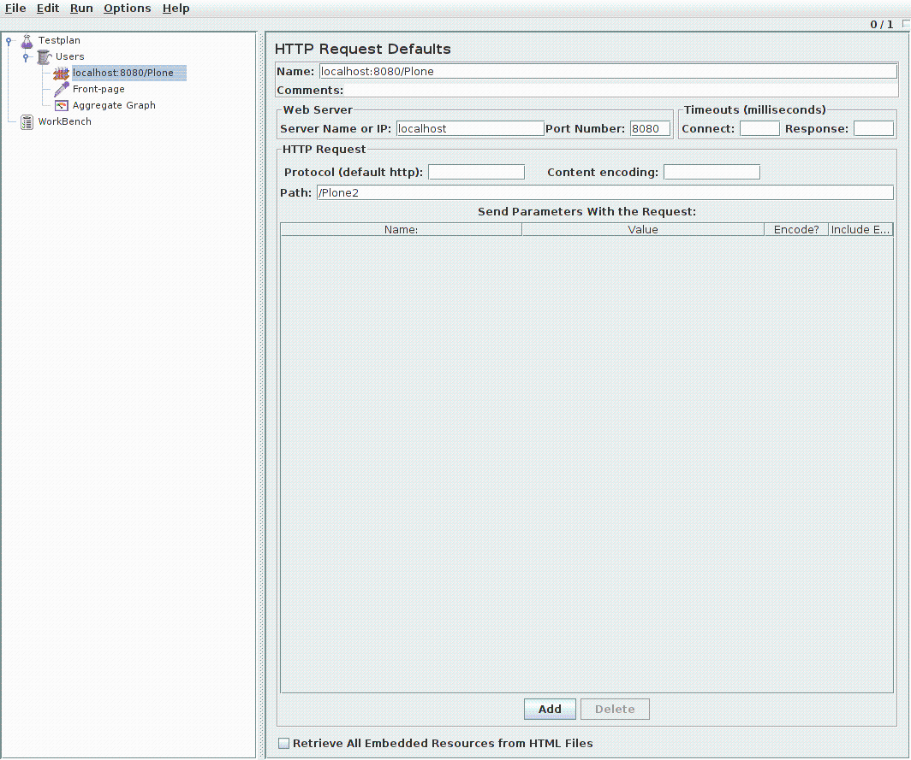
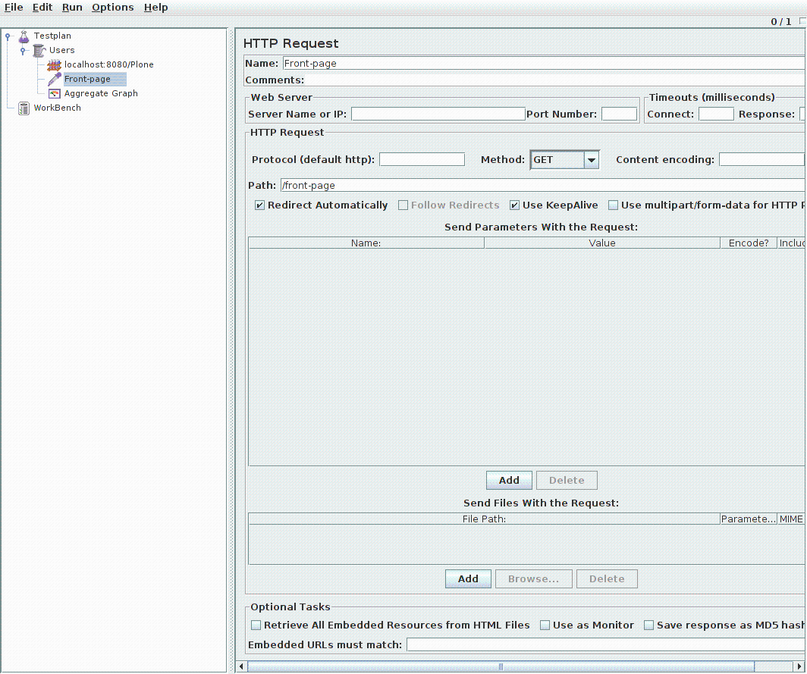
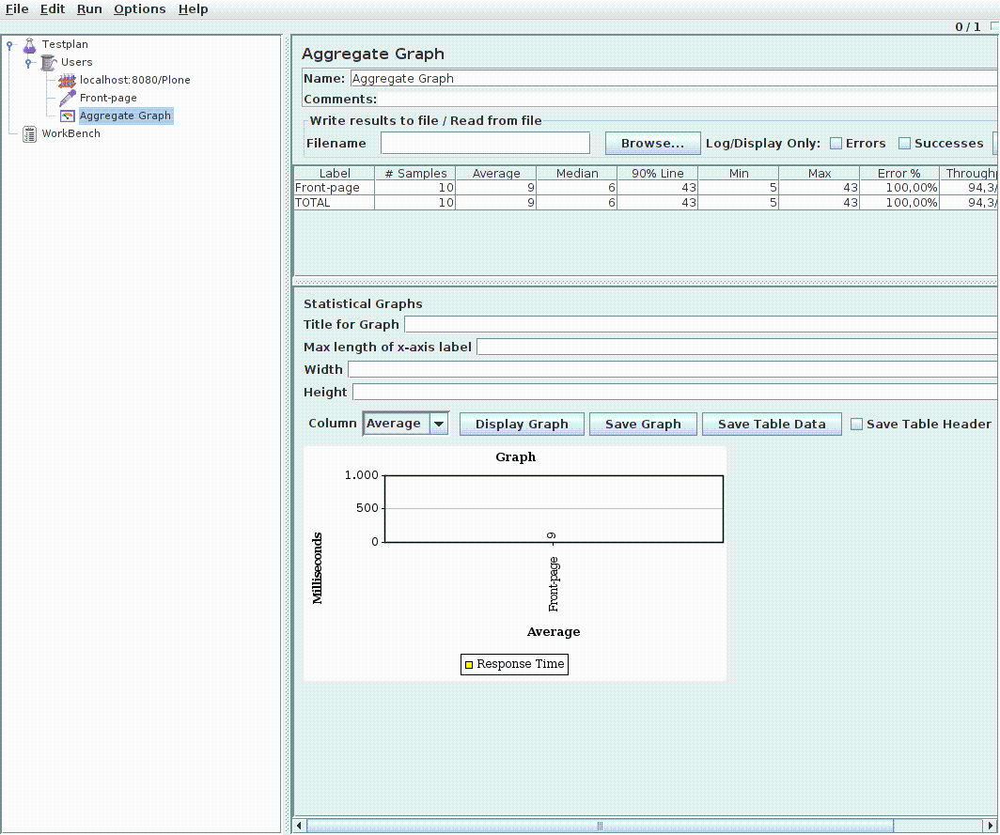

===============================
Performance Testing with jMeter
===============================

Introduction
------------

This document explains how to run performance test with jMeter agains a Plone
site.

Step 1: Install jMeter
----------------------

The easiest way to install jMeter ist to install it from the package sources
of your distribution (e.g. on Debian/Ubuntu)::

    $ sudo apt-get install jmeter

.. note:: Further install options
   http://jmeter.apache.org/usermanual/get-started.html

Step 2 : Create a Test Plan
---------------------------

Once you've started jMeter (e.g. by typing "jmeter" into the command line)
you will see an empty Testplan:

   jMeter User Interface

Elements of a minimal test plan:

    * Thread Group

      The root element of every test plan. Simulates the (concurrent) users
      than run all requests. Each thread simulates a single user.

    * HTTP Request Default (Configuration Element)

    * HTTP Request (Sampler)

    * Summary Report (Listener)

Step 3: Create a Thread Group
-----------------------------

    Testplan > Add > Threads (Users) > Thread-Group (this might vary
    dependent on the jMeter version you are using)

    Name: Users
    Number of Threads (users): 2
    Ramp-Up Period (in seconds): 1
    Loop Count: 10

   Thread Group

Step 4: Create HTTP Request Defaults
------------------------------------

    Testplan > Users > Add > Config Element > HTTP Request Defaults

    Name: localhost:8080/Plone
    Server Name or IP: localhost
    Port Number: 8080
    Path /Plone

    (The values are just defaults, not prefixes)

   HTTP Request Defaults

Step 5: Create an HTTP Request
------------------------------

   Thread Group

    Testplan > Users > Add > Sampler > HTTP Request

    Name: Front-page
    Path: /Plone/front-page

   HTTP Request

Step 6: Aggregate Graph
-----------------------

    Testplan > Users > Add > Listener > Aggregate Graph

   HTTP Request

Step 6: View Results Tree
-------------------------

    Testplan > Users > Add > Listener > View Results Tree (optional)

Step 7: Save Test Plan
----------------------

    File > Save Testplan as

Step 8: Run Performance Tests
-----------------------------

    Run > Start

Next Steps
----------

Creating a test plan:

http://jmeter.apache.org/usermanual/build-web-test-plan.html
