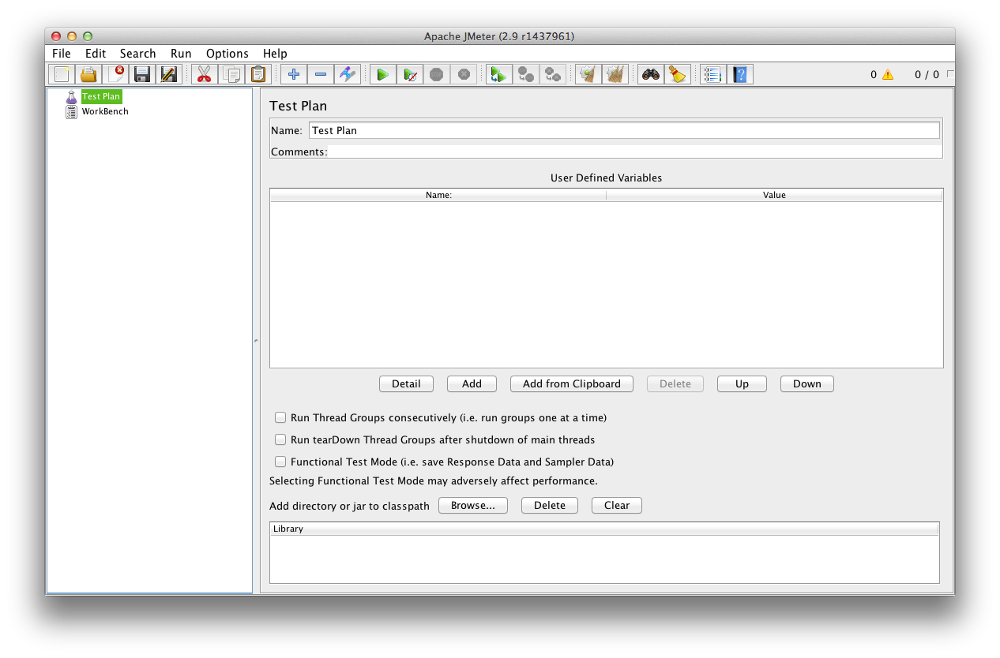

==============================================================================
Performance Testing with jMeter
==============================================================================

Introduction
------------

This document explains how to run performance test with jMeter agains a Plone
site.

Step 1: Install jMeter
----------------------

The easiest way to install jMeter ist to install it from the package sources
of your distribution (e.g. on Debian/Ubuntu)::

    $ sudo apt-get install jmeter

.. note:: Further install options
   http://jmeter.apache.org/usermanual/get-started.html

Step 2 : Create a minimal Testplan
----------------------------------

Once you've started jMeter (e.g. by typing "jmeter" into the command line)
you will see an empty Testplan:

   jMeter User Interface

Elements of a minimal test plan:

    * Thread Group

      The root element of every test plan. Simulatest the (concurrent) users
      than run all requests. Each thread simulates a single user.

    * HTTP Request Default (Configuration Element)

    * HTTP Request (Sampler)

    * Summary Report (Listener)

Test Plan:

    Testplan > Add > Threads (Users) > Thread-Gruppe (this might vary
    dependent on the jMeter version you are using)

    Name: Users
    Number of Threads (users): 2
    Ramp-Up Period (in seconds): 1
    Loop Count: 10

    Testplan > Users > Add > Config Element > HTTP Request Defaults

    Name: localhost:8080/Plone
    Server Name or IP: localhost
    Port Number: 8080
    Path /Plone

    (The values are just defaults, not prefixes)

    Testplan > Users > Add > Sampler > HTTP Request

    Name: Front-page
    Path: /Plone/front-page

    Testplan > Users > Add > Listener > Aggregate Graph

    Testplan > Users > Add > Listener > View Results Tree (optional)

Save Test Plan:

    File > Save Testplan as

Run Test:

    Run > Start

Creating a test plan:

http://jmeter.apache.org/usermanual/build-web-test-plan.html

Step 3: Run jMeter Tests on Jenkins
-----------------------------------

  * Install jMeter on your Jenkins machine. Or even better install it on a
    dedicated performance testing machine to make sure your performance tests
    are not affected by other server processes.

  * Install the Jenkins Performance Plugin: https://wiki.jenkins-ci.org/display/JENKINS/Performance+Plugin

  * Create a "New Free-Style Jenkins Job":
    Name: myproject-performance-test-dev

  * Source-Code-Management > Git > Repositories: git@bitbucket.org:tisto/myproject.git

  * Source-Code-Management > Git > Branches to build: master

  * Build > Add Build > Shell > Befehl: jmeter -n -t etc/myproject.jmx -l results.jtl

    https://issues.jenkins-ci.org/browse/JENKINS-16627

  * Post-Build-Actions > Add post-build action > Publish Performance test result report

  * Post-Build-Actions > Publish Performance test result report > Add a new report: jMeterj

  * Post-Build-Actions > Publish Performance test result report > Performance report > jMeter > Report files: **/*.jtl

Performance: Failed to parse /srv/www/jenkins/.../myproject.jtl: Content is not allowed in prolog.

Record Test
-----------

jMeter:

    Workbench > Add > Non Test Elements > HTTP Proxy Server

    Workbench > HTTP Proxy Server > Add > Logic Controller > Simple Controller

Firefox:

    Bearbeiten > Einstellungen > Erweitert >
    Network (TAB) > Einstellungen > Manuelle Proxy Konfiguration
